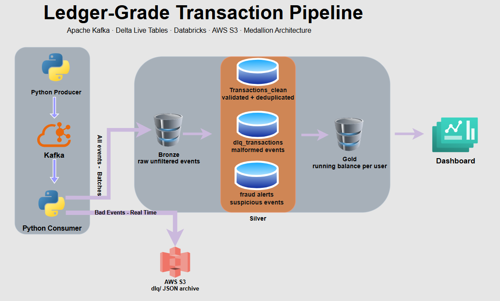

# Ledger-Grade Transaction Pipeline

> A fintech-grade real-time streaming pipeline built to prove that no matter how chaotic the input — duplicates, out-of-order events, malformed payloads — every customer balance updates exactly once.



---

## Project Overview

In financial systems, processing a transaction twice is not a bug — it's a disaster. This pipeline is built around one guarantee: **exactly-once processing**.

The pipeline ingests a continuous stream of fake Nigerian fintech transactions, intentionally injected with chaos — duplicates, missing fields, backdated timestamps, and fraud patterns — and routes every event correctly across a Bronze → Silver → Gold Medallion Architecture on Databricks.


---

## Tech Stack

| Tool | Purpose | Why |
|---|---|---|
| Apache Kafka | Event streaming | Industry standard message broker for real-time pipelines |
| Python (kafka-python) | Producer + Consumer | Generates chaos events and bridges Kafka to Databricks |
| Databricks | Processing platform | Managed Spark environment with Delta Live Tables |
| Delta Live Tables | Stream processing | Declarative pipeline with built-in checkpointing and exactly-once guarantees |
| Delta Lake | ACID storage | Supports MERGE upserts, time travel, and schema enforcement |
| AWS S3 | DLQ archive | Cheap, durable long-term storage for bad events queryable via Athena |
| Docker | Local Kafka setup | Containerised Kafka for local development |
| Medallion Architecture | Data organisation | Bronze → Silver → Gold separation of concerns |

---

## The Chaos Engine

The Python producer intentionally generates 10 types of events to stress-test the pipeline:

| Event type | Percentage | Purpose |
|---|---|---|
| Clean transaction | 50% | Normal deposits, withdrawals, transfers |
| Duplicate | 12% | Same transaction_id sent twice |
| Out-of-order | 7% | Backdated timestamps simulating late arrivals |
| Missing amount | 5% | Malformed — no amount field |
| Missing user_id | 5% | Malformed — no user identifier |
| Invalid type | 4% | Transaction type not in allowed list |
| Negative amount | 3% | Invalid negative transaction value |
| High frequency fraud | 5% | Same user sends 6 transactions in 2 seconds |
| Large withdrawal fraud | 4% | Single withdrawal above ₦150,000 |
| Repeated amount fraud | 5% | Same amount sent 3 times by same user |

---

## Medallion Architecture

### Bronze — `ledger-catalog.raw.transactions_raw`
Raw landing zone. Every event lands here exactly as received — duplicates, malformed events, everything. No filtering. No judgment. The Python consumer writes here in batches of 10.

### Silver — `ledger-catalog.processed`
This is where the intelligence lives. Three tables:

**`transactions_clean`** — validated and deduplicated events only
- Drops events with missing `transaction_id`, `user_id`, or `amount`
- Drops events with invalid transaction types
- Deduplicates by `transaction_id`
- Casts types correctly

**`dlq_transactions`** — quarantine table
- Catches every event that fails validation
- Adds `error_reason` column explaining exactly why it failed
- Nothing is ever silently dropped

**`fraud_alerts`** — suspicious events
- Flags large withdrawals above ₦100,000
- Flags high value transactions
- Reads only from clean Silver events — no bad data reaches fraud detection

### Gold — `ledger-catalog.serving.user_balances`
One row per customer. Aggregated from Silver clean events.
- Running balance (deposits minus withdrawals)
- Total deposits and withdrawals
- Transaction count
- Last updated timestamp

---

## Proving Idempotency

The core claim of this pipeline is that the same transaction processed multiple times produces the same result as processing it once.

Run this query to prove it:

```sql
-- Send the same transaction_id 10 times via the producer
-- Then check how many times it appears in Silver

SELECT transaction_id, COUNT(*) as count
FROM `ledger-catalog`.processed.transactions_clean
GROUP BY transaction_id
HAVING count > 1;
```

**Expected result: zero rows.** Every `transaction_id` appears exactly once regardless of how many times the producer sends it.

---

## The NaN vs NULL Discovery

During development the DLQ table was empty even though the producer was sending malformed events. The bug: malformed `amount` values were arriving as `NaN` (Not a Number) not `NULL`.

```python
# This filter was missing NaN
col("amount").isNull()

# Correct filter catches both
col("amount").isNull() | col("amount").isNaN()
```

This is a real production gotcha — Spark treats `NaN` and `NULL` differently. A filter for `NULL` will never catch `NaN` values. The fix was adding `.isNaN()` to every validation check alongside `.isNull()`.

---

## Live Dashboard

Built on Databricks SQL with 5 widgets:
- Total transactions processed
- Duplicate rate caught by deduplication
- DLQ breakdown by error reason
- Fraud alerts by category
- Top 10 user balances

---

## How to Run Locally

### Prerequisites
- Docker Desktop
- Python 3.9+
- Databricks account (free trial)
- AWS account with S3 bucket

### Step 1 — Start Kafka
```bash
docker-compose up -d
```

### Step 2 — Install dependencies
```bash
pip install kafka-python faker databricks-sql-connector boto3 pandas python-dotenv
```

### Step 3 — Set up environment variables
Create a `.env` file in your project root:

```env
DATABRICKS_HOST=https://your-workspace.azuredatabricks.net
DATABRICKS_TOKEN=your_token_here
DATABRICKS_HTTP_PATH=/sql/1.0/warehouses/your_warehouse_id
AWS_ACCESS_KEY_ID=your_key_here
AWS_SECRET_ACCESS_KEY=your_secret_here
AWS_REGION=us-east-1
AWS_S3_BUCKET=your_bucket_name
```
### Step 4 — Start the producer
```bash
python producer.py
```

### Step 5 — Start the consumer
```bash
python consumer.py
```

### Step 6 — Start the DLT pipeline
Go to Databricks → your pipeline → click **Start**

---

## Future Improvements

- Replace local Kafka with **Confluent Cloud** for true cloud-to-cloud streaming
- Add **Apache Flink** for more advanced stateful stream processing
- Implement **Schema Registry** with Avro for message contract enforcement
- Add **Grafana + Prometheus** for infrastructure-level monitoring
- Build a **DLQ replayer** script to reprocess fixed bad events

---

## Built by Amara
Africa's fintech data engineer. World is next. 

[LinkedIn](https://www.linkedin.com/in/amankwe-amarachi/)